# WallBay

## App Description

Wallbay, is my final project for the Udacity Android Developer Nanodegreee. 
The app consist of a wallpaper/images app which uses the [Pixabay](https://pixabay.com/), [Pexels](https://www.pexels.com/) and [Unsplash](https://unsplash.com/) API endpoints and allow users to search and find free images which they can downloaded, edit or use as wallpaper in their phones.

## Features

The app main features are:
* Browse and search over 3 million unique images.
* Display images statistic.
* Add images to favorite.
* Download raw images using background service.
* Multiple images select to add to favorite or download.
* In app image editing.
* Share images to social media or with link.
* Set images as wallpaper from the app.

## Screenshots
 

  
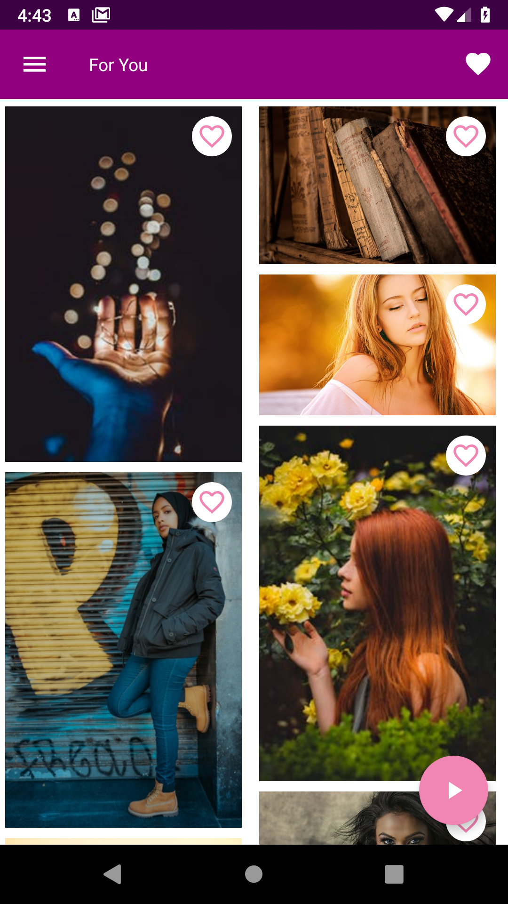
  
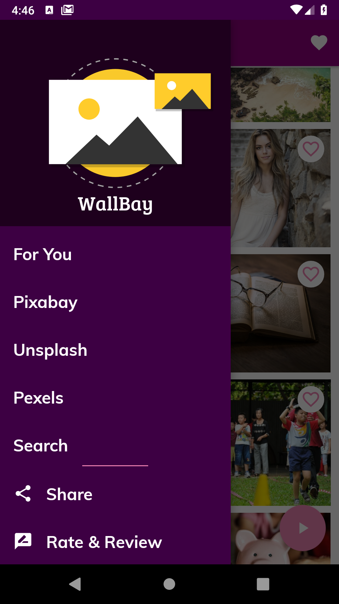
 
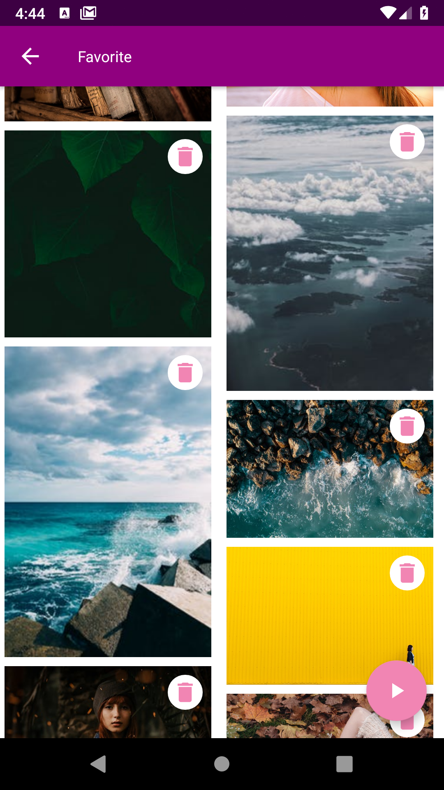
  
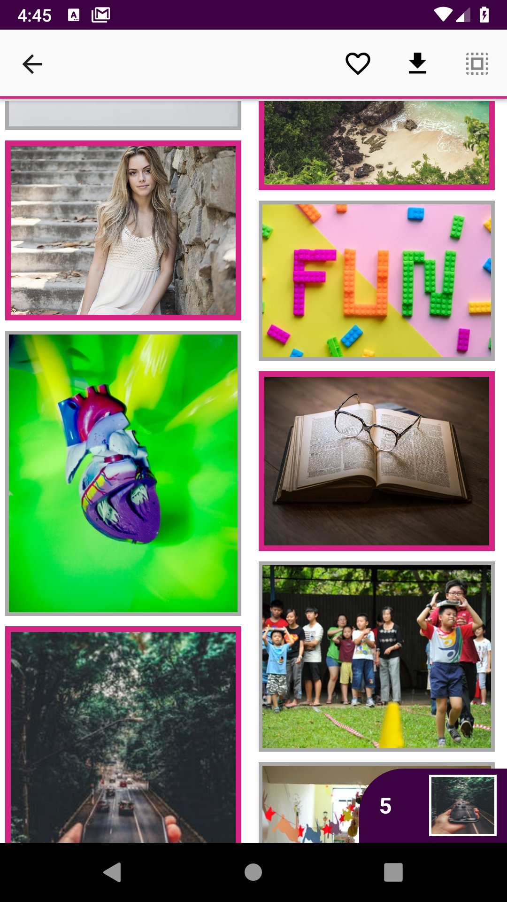
  
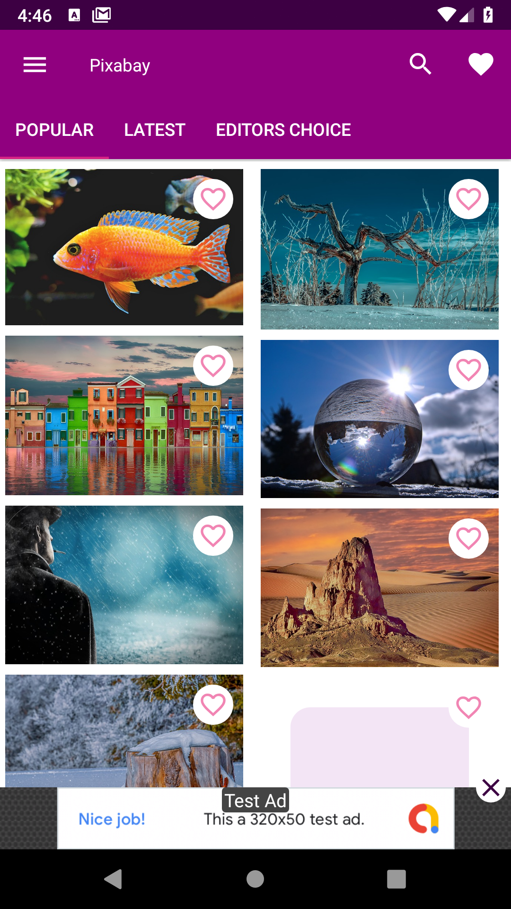
  
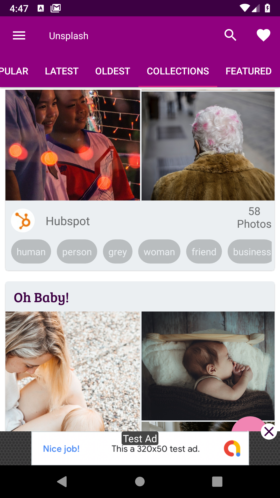
  
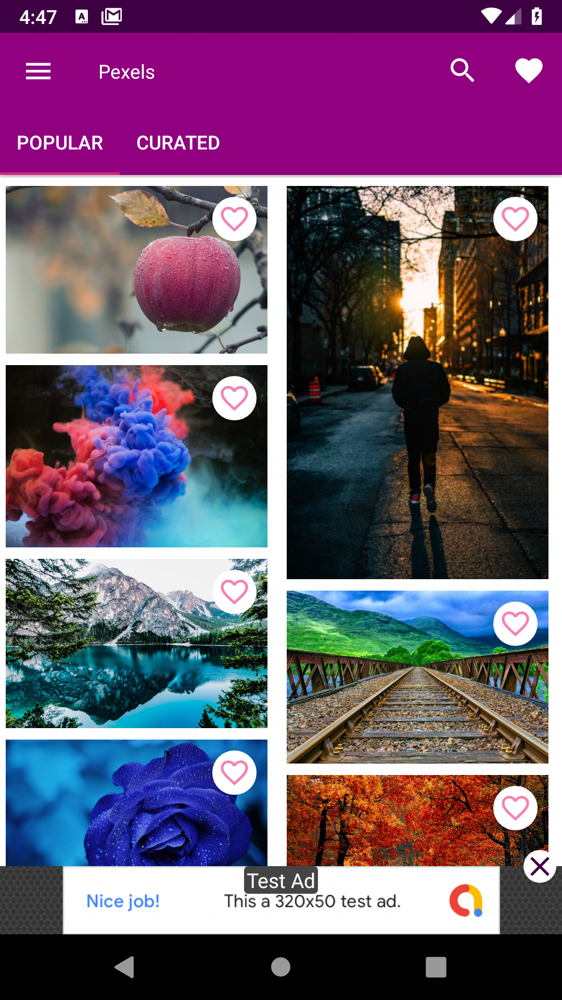
  
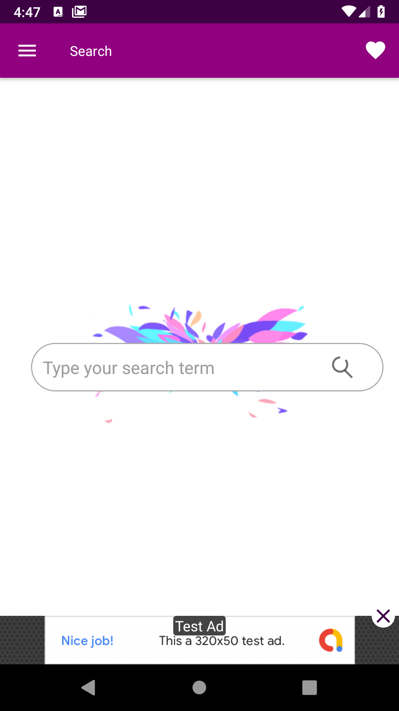
  
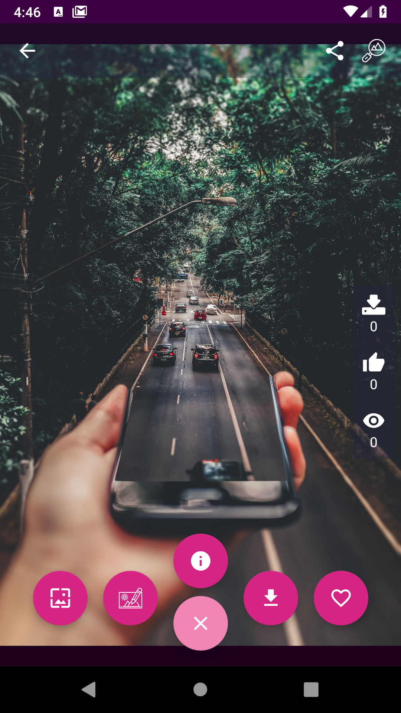
  
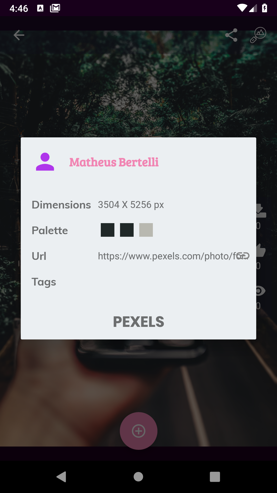
  
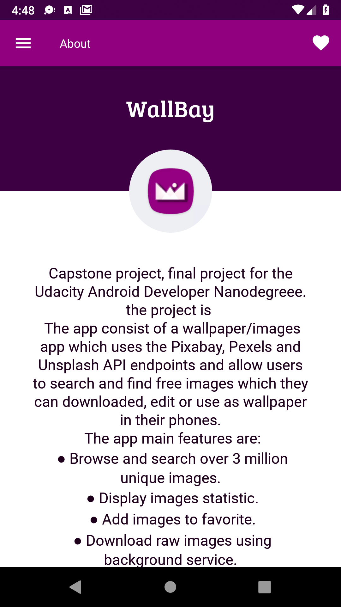

## Acknowledgments

* The app uses the [PhotoEditor](https://github.com/burhanrashid52/PhotoEditor) library and app example for image editing.

## License

This project is licensed under the MIT License - see the [LICENSE.md](LICENSE.md) file for details

MIT License

Copyright (c) 2019 medyas

Permission is hereby granted, free of charge, to any person obtaining a copy
of this software and associated documentation files (the "Software"), to deal
in the Software without restriction, including without limitation the rights
to use, copy, modify, merge, publish, distribute, sublicense, and/or sell
copies of the Software, and to permit persons to whom the Software is
furnished to do so, subject to the following conditions:

The above copyright notice and this permission notice shall be included in all
copies or substantial portions of the Software.

THE SOFTWARE IS PROVIDED "AS IS", WITHOUT WARRANTY OF ANY KIND, EXPRESS OR
IMPLIED, INCLUDING BUT NOT LIMITED TO THE WARRANTIES OF MERCHANTABILITY,
FITNESS FOR A PARTICULAR PURPOSE AND NONINFRINGEMENT. IN NO EVENT SHALL THE
AUTHORS OR COPYRIGHT HOLDERS BE LIABLE FOR ANY CLAIM, DAMAGES OR OTHER
LIABILITY, WHETHER IN AN ACTION OF CONTRACT, TORT OR OTHERWISE, ARISING FROM,
OUT OF OR IN CONNECTION WITH THE SOFTWARE OR THE USE OR OTHER DEALINGS IN THE
SOFTWARE.
